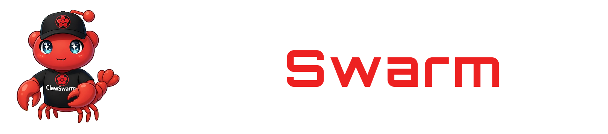
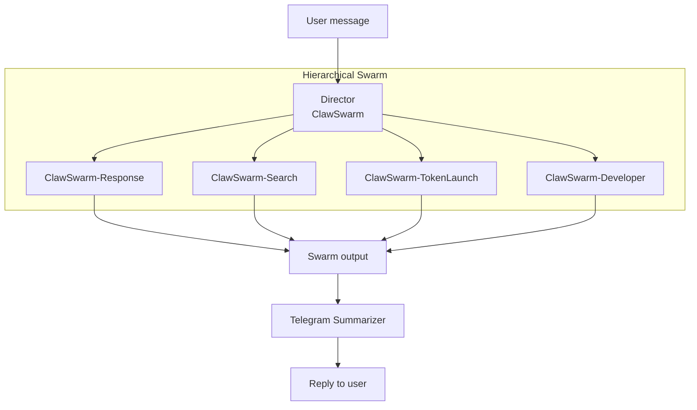
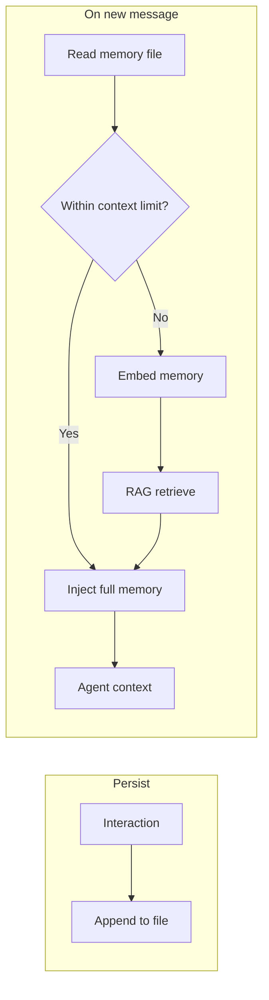

# ClawSwarm



<p align="center">
  <a href="https://pypi.org/project/claw-swarm/" target="_blank">
    <picture>
      <source srcset="https://img.shields.io/pypi/v/swarms?style=for-the-badge&color=3670A0" media="(prefers-color-scheme: dark)">
      
    </picture>
  </a>
  <a href="https://pypi.org/project/claw-swarm/" target="_blank">
    <picture>
      <source srcset="https://img.shields.io/pypi/dm/swarms?style=for-the-badge&color=3670A0" media="(prefers-color-scheme: dark)">
      
    </picture>
  </a>
  <a href="https://twitter.com/swarms_corp/">
    <picture>
      <source srcset="https://img.shields.io/badge/Twitter-Follow-1DA1F2?style=for-the-badge&logo=twitter&logoColor=white" media="(prefers-color-scheme: dark)">
      
    </picture>
  </a>
  <a href="https://discord.gg/EamjgSaEQf">
    <picture>
      <source srcset="https://img.shields.io/badge/Discord-Join-5865F2?style=for-the-badge&logo=discord&logoColor=white" media="(prefers-color-scheme: dark)">
      
    </picture>
  </a>
</p>


**A smaller, lighter-weight version of [OpenClaw](https://github.com/openclaw/openclaw)**—natively multi-agent, compiles to Rust, and built on the **[Swarms](https://github.com/kyegomez/swarms) framework** and Swarms ecosystem. One API, unified messaging across Telegram, Discord, and WhatsApp with optional Claude-powered reasoning. Production-ready: gRPC gateway, prompts in code (`claw_swarm.prompts`), and 24/7 operation. Dockerfile included (Python 3.12).

---

## Requirements

- Python 3.10+
- Dependencies listed in `requirements.txt` (no version pins; use a venv and pin locally if needed)
- [Swarms](https://github.com/kyegomez/swarms) framework and Swarms ecosystem; [Claude Code](https://docs.anthropic.com/en/docs/build-with-claude/claude-code) (for the Claude tool)
- Platform credentials for the channels you enable: Telegram Bot Token, Discord Bot Token and Channel IDs, and/or WhatsApp Cloud API credentials

---

## Installation

```bash
pip3 install -U claw-swarm
```

---

## Environment variables

Set these in your shell or in a `.env` file (e.g. `--env-file .env` with Docker). Omit a platform’s credentials to disable that channel.

| Variable | Purpose | Default |
|----------|---------|---------|
| **Gateway** | | |
| `GATEWAY_HOST` | Bind address (gateway) or gateway host (agent) | `[::]` (server), `localhost` (agent) |
| `GATEWAY_PORT` | gRPC port | `50051` |
| `GATEWAY_TLS` | Enable TLS: `1`, `true`, or `yes` | — |
| `GATEWAY_TLS_CERT_FILE` | Path to TLS certificate file | — |
| `GATEWAY_TLS_KEY_FILE` | Path to TLS private key file | — |
| **Channels** | | |
| `TELEGRAM_BOT_TOKEN` | Telegram Bot API token | — |
| `DISCORD_BOT_TOKEN` | Discord bot token | — |
| `DISCORD_CHANNEL_IDS` | Comma-separated Discord channel IDs | — |
| `WHATSAPP_ACCESS_TOKEN` | WhatsApp Cloud API access token | — |
| `WHATSAPP_PHONE_NUMBER_ID` | WhatsApp Cloud API phone number ID | — |
| `WHATSAPP_QUEUE_PATH` | Optional WhatsApp queue path | — |
| **Agent** | | |
| `AGENT_MODEL` | Swarms agent model | `gpt-4o-mini` |
| `OPENAI_API_KEY` | OpenAI API key (for agent model) | — |
| `ANTHROPIC_API_KEY` | Anthropic API key (for Claude tool) | — |
| **Memory** | | |
| `AGENT_MEMORY_FILE` | Agent memory markdown filename (project root) | `agent_memory.md` |
| `AGENT_MEMORY_MAX_CHARS` | Max characters of memory to load into context | `100000` |

---

## Quick Start

**1. Set environment variables** for the channels you use (see **Environment variables** above for the full table).

**2. Run the full stack** (gateway + agent in one process group):

```
clawswarm run
```

Pass channel tokens and `AGENT_MODEL` via `--env-file .env` or `-e`.


---

## Overview

ClawSwarm is a streamlined, multi-agent alternative to OpenClaw. It delivers **natively multi-agent** AI that responds to users on Telegram, Discord, and WhatsApp through a centralized **Messaging Gateway**. The gateway normalizes incoming messages; the **ClawSwarm Agent** (Swarms framework, configurable system prompt, Claude as a tool) processes each message and replies via a **Replier** back to the originating channel. Built on the Swarms ecosystem for reliability, security, and minimal operational overhead—with a path to **compile to Rust** for performance and deployment flexibility.

---

## Features

- **Multi-channel messaging** — One API for Telegram, Discord, and WhatsApp. The gateway normalizes messages; the agent replies back to the correct channel.

- **Hierarchical multi-agent architecture** — A **director** agent (ClawSwarm) receives each message, creates a plan, and delegates to specialist **worker** agents via structured orders (SwarmSpec). Workers handle response, search, token launch, or code; the director orchestrates and the **Telegram Summarizer** turns combined output into a concise, emoji-free reply for chat.

- **Specialist workers** — **ClawSwarm-Response** (greetings, short answers), **ClawSwarm-Search** (web/semantic search via Exa), **ClawSwarm-TokenLaunch** (launch tokens and claim fees on Swarms World/Solana), **ClawSwarm-Developer** (implementation and debugging via Claude Code). Each worker has a focused role and tools; the director chooses who does what.

- **Claude as a tool** — Deep reasoning and code are handled by Claude (e.g. via the Developer worker’s `run_claude_developer`). Configurable system prompts in `claw_swarm.prompts`; override with `create_agent(system_prompt=...)`.

- **Unified gRPC gateway** — Single ingest API for all channels; add or remove platforms without changing agent logic. Optional TLS, health checks, and normalized `UnifiedMessage` schema.

- **Lighter than OpenClaw** — Smaller footprint and simpler stack; same multi-channel, multi-agent vision without the full OpenClaw surface area. Path to compile to Rust for performance and deployment flexibility.

- **Production-ready** — Environment-based configuration, long-running agent loop, Dockerfile, and 24/7 operation under systemd or managed runtimes.

---

## Architecture


```
     Telegram    Discord    WhatsApp
          \        |        /
           \       v       /
            +--------------+
            |   Gateway    |   unified ingest (gRPC)
            +------+-------+
                   |
                   v
            +--------------+
            |    Agent     |   Hierarchical Swarm + Summarizer
            +------+-------+
                   |
                   v
            +--------------+
            |   Replier    |   send back to each channel
            +------+-------+
                   |
     Telegram    Discord    WhatsApp
```

ClawSwarm starts with a gRPC gateway that ingests messages from Telegram, Discord, and WhatsApp, normalizing each into a unified schema. An agent runner polls the gateway on a short cadence, pulling new messages in batches and maintaining its own cursor for reliable delivery without an external broker.

Each message is routed into a hierarchical multi-agent system: a director agent plans and delegates to specialist workers covering simple responses, web search, token operations, and code execution then a summarizer agent condenses the combined output into a clean, concise reply. That reply is delivered back to the originating platform and channel, and the full interaction is saved to a shared memory file so context persists across all channels and restarts. 

### Hierarchical architecture

The core of ClawSwarm is a **hierarchical multi-agent system** built on Swarms’ `HierarchicalSwarm`. A single **director** agent sits at the top: it receives every user message, decides what to do, and delegates to one or more **worker** agents by emitting structured **SwarmSpec** orders (plan + task assignments). Workers are specialists with narrow roles and tools; they run their tasks and return results. The director does not execute tools itself—it only plans and delegates. After the swarm finishes, a dedicated **Telegram Summarizer** agent condenses the raw output into a short, plain-text reply suitable for chat (no emojis).

This design keeps the director focused on orchestration and intent, while search, code, token operations, and simple replies are handled by the right worker. You get multi-agent behavior with a clear chain of responsibility and a single, chat-friendly response to the user.

### Hierarchical swarm



- **Director (ClawSwarm):** Receives the user message, creates a plan, and outputs **SwarmSpec** (structured plan + orders) so the swarm runtime can invoke the right workers. No tools; orchestration only.
- **Workers:** Execute the assigned tasks (response, search, token launch, or code) and contribute to the combined swarm output.
- **Telegram Summarizer:** Post-processes the swarm output into a concise, emoji-free reply for the channel.

### Agents

| Agent | Role | Tools / capabilities |
|-------|------|----------------------|
| **ClawSwarm** (Director) | Orchestrator; creates a plan and assigns tasks to workers via SwarmSpec. Does not run tools itself. | Plan + orders (structured output for the swarm). |
| **ClawSwarm-Response** | Simple replies and general questions; greetings, short factual answers, clarifications. | None (LLM only). |
| **ClawSwarm-Search** | Web and semantic search. | `exa_search` — current events, research, fact-checking. |
| **ClawSwarm-TokenLaunch** | Launch tokens and claim fees on Swarms World (Solana). | `launch_token`, `claim_fees`. |
| **ClawSwarm-Developer** | Code, refactor, debug, and implement via Claude Code. | `run_claude_developer` (Read, Write, Edit, Bash, Grep, Glob, etc.). |
| **ClawSwarm-TelegramSummarizer** | Summarize swarm output for chat; plain text, no emojis. | None (LLM only). |

Worker agents are created in `claw_swarm.agent.worker_agents` (e.g. `create_response_agent()`, `create_search_agent()`, `create_developer_agent()`, `create_token_launch_agent()`) and composed into the swarm in `claw_swarm.agent.main` via `create_agent()`, which returns a `HierarchicalSwarm` ready for `.run(task)`.

### Memory

Conversation history is persisted in a markdown file (default `agent_memory.md` at project root, configurable via `AGENT_MEMORY_FILE`). After each reply, the interaction is appended to the file with timestamp, platform, channel, and user/agent text. When handling a new message, the agent reads this file and injects it into the prompt as prior context so it can refer to past conversations across Telegram, Discord, WhatsApp, and restarts. If the file grows beyond the context window (bounded by `AGENT_MEMORY_MAX_CHARS`), the memory is embedded and RAG is used to retrieve only the most relevant chunks for the current query, so long-term memory is preserved without overflowing the context.



### Relationship to OpenClaw

[OpenClaw](https://github.com/openclaw/openclaw) is a full-featured personal AI assistant (gateway, many channels, voice, canvas, nodes, skills). **ClawSwarm** is a smaller, lighter-weight take on that vision: natively multi-agent, built on the Swarms framework and Swarms ecosystem, with a path to compile to Rust. Use ClawSwarm when you want a lean, multi-agent messaging layer; use OpenClaw when you need the full product (companion apps, voice, canvas, etc.).

| Feature | ClawSwarm | OpenClaw |
|---------|-----------|----------|
| **Transport** | gRPC over HTTP/2, Protobuf, optional TLS | WebSockets |
| **Multi-agent** | Native — hierarchical director + workers | Single agent |
| **Customizable agents** | Add workers with any tools, model, and role | Not natively extensible |
| **Skills compatibility** | Backwards compatible with all Swarms skills | Custom skill format |
| **Agent memory** | Persistent markdown memory + RAG for long history | Session-scoped |
| **Swarm memory** | Shared across all channels and restarts | Not shared |
| **Channels** | Telegram, Discord, WhatsApp | Telegram, Discord, WhatsApp, and more |
| **Voice / Canvas / Nodes** | Not included | Full product |
| **Compile to Rust** | Path included | No |
| **Footprint** | Lean, minimal dependencies | Full-featured, larger surface area |
| **Best for** | Multi-agent messaging layer, extensible bots | Full personal AI assistant product |


---

## Gateway API

gRPC service:

- **PollMessages** — Fetch messages since a timestamp (used by the agent runner).
- **StreamMessages** — Server-streaming delivery of new messages.
- **Health** — Liveness and version.

Messages are normalized to a single schema: `UnifiedMessage` (id, platform, channel_id, thread_id, sender, text, attachments, timestamp). Use TLS and restrict network access in production.

---

## Security and Operations

- **Secrets** — Do not commit tokens or API keys. Use environment variables or a secrets manager.
- **Transport** — Enable gateway TLS in production (`GATEWAY_TLS=1` and valid certificate and key).
- **Access control** — Restrict which clients can reach the gRPC port (firewall, VPC, or mTLS as required).

---

## License

See the repository LICENSE for terms of use.

---

## Citation

If you use ClawSwarm in your research or work, please cite:

```bibtex
@software{gomez2025clawswarm,
  author       = {Gomez, Kye and {The Swarms Corporation}},
  title        = {ClawSwarm: A Team of 10,000 Productivity Agents for You},
  year         = {2025},
  publisher    = {The Swarms Corporation},
  url          = {https://github.com/kyegomez/ClawSwarm},
  note         = {A lightweight, natively multi-agent alternative to OpenClaw, supporting Telegram, Discord, and WhatsApp via a unified gRPC gateway}
}
```
