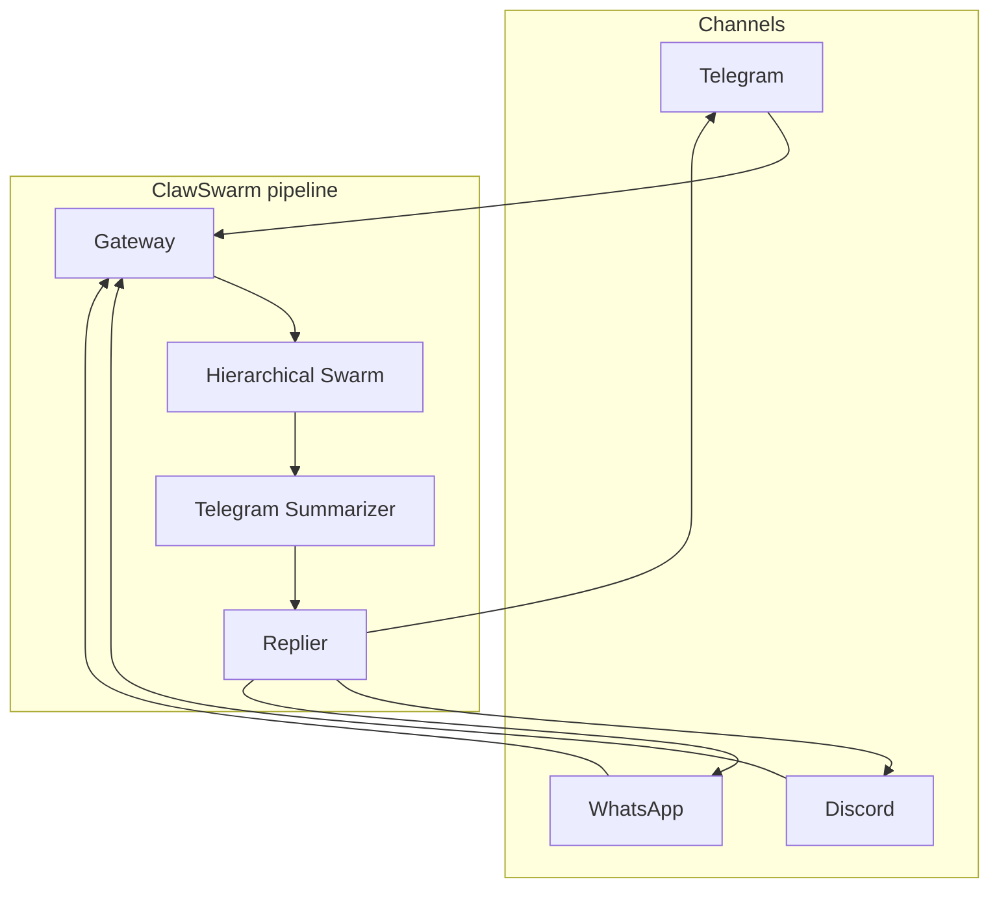
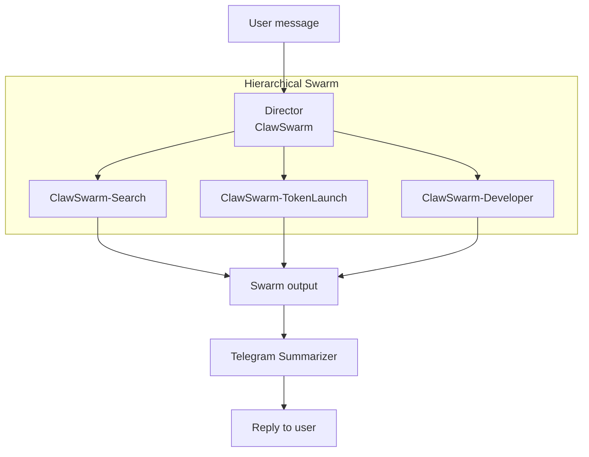

# ClawSwarm


<p align="center">
  <a href="https://pypi.org/project/claw-swarm/" target="_blank">
    <picture>
      <source srcset="https://img.shields.io/pypi/v/swarms?style=for-the-badge&color=3670A0" media="(prefers-color-scheme: dark)">
      
    </picture>
  </a>
  <a href="https://pypi.org/project/claw-swarm/" target="_blank">
    <picture>
      <source srcset="https://img.shields.io/pypi/dm/swarms?style=for-the-badge&color=3670A0" media="(prefers-color-scheme: dark)">
      
    </picture>
  </a>
  <a href="https://twitter.com/swarms_corp/">
    <picture>
      <source srcset="https://img.shields.io/badge/Twitter-Follow-1DA1F2?style=for-the-badge&logo=twitter&logoColor=white" media="(prefers-color-scheme: dark)">
      
    </picture>
  </a>
  <a href="https://discord.gg/EamjgSaEQf">
    <picture>
      <source srcset="https://img.shields.io/badge/Discord-Join-5865F2?style=for-the-badge&logo=discord&logoColor=white" media="(prefers-color-scheme: dark)">
      
    </picture>
  </a>
</p>


**A smaller, lighter-weight version of [OpenClaw](https://github.com/openclaw/openclaw)**—natively multi-agent, compiles to Rust, and built on the **[Swarms](https://github.com/kyegomez/swarms) framework** and Swarms ecosystem. One API, unified messaging across Telegram, Discord, and WhatsApp with optional Claude-powered reasoning. Production-ready: gRPC gateway, prompts in code (`claw_swarm.prompts`), and 24/7 operation. Dockerfile included (Python 3.12).

---

## Overview

ClawSwarm is a streamlined, multi-agent alternative to OpenClaw. It delivers **natively multi-agent** AI that responds to users on Telegram, Discord, and WhatsApp through a centralized **Messaging Gateway**. The gateway normalizes incoming messages; the **ClawSwarm Agent** (Swarms framework, configurable system prompt, Claude as a tool) processes each message and replies via a **Replier** back to the originating channel. Built on the Swarms ecosystem for reliability, security, and minimal operational overhead—with a path to **compile to Rust** for performance and deployment flexibility.

**Key capabilities**

- **Lighter than OpenClaw** — Smaller footprint and simpler stack; same multi-channel vision without the full OpenClaw surface area.

- **Natively multi-agent** — Designed from the ground up for multi-agent orchestration on the Swarms framework and Swarms ecosystem.

- **Unified ingestion** — One gRPC API for all supported channels; add or remove platforms without changing agent logic.

- **Swarms-native agent** — Industry-standard orchestration, configurable model and system prompt, Claude available as a tool for deep reasoning and code.

- **Compiles to Rust** — Build path to Rust for performance and deployment flexibility.

- **Prompts in code** — Agent and Claude-tool prompts are Python strings in `claw_swarm.prompts`; override via `create_agent(system_prompt=...)` or edit the module.

- **Production-ready** — Optional TLS, environment-based configuration, long-running agent loop suitable for systemd, Docker, or managed runtimes.

---

## Architecture

### Message flow

```
     Telegram    Discord    WhatsApp
          \        |        /
           \       v       /
            +--------------+
            |   Gateway    |   unified ingest (gRPC)
            +------+-------+
                   |
                   v
            +--------------+
            |    Agent     |   Hierarchical Swarm + Summarizer
            +------+-------+
                   |
                   v
            +--------------+
            |   Replier    |   send back to each channel
            +------+-------+
                   |
     Telegram    Discord    WhatsApp
```

**Flow:** User messages arrive on any channel → Gateway normalizes and exposes via gRPC → Hierarchical Swarm (director + workers) runs → Telegram Summarizer shortens output for chat (no emojis) → Replier sends the response to the correct channel.

### Hierarchical swarm (Mermaid)

The main agent is a **HierarchicalSwarm**: a director assigns tasks to specialist workers, then a summarizer prepares the final reply for chat.





**Director:** Receives the user message, creates a plan, and issues orders (SwarmSpec) to one or more workers. **Workers** execute their tasks (search, token launch, or code). The **Telegram Summarizer** turns the combined output into a concise, emoji-free reply for the channel.

### Agents

| Agent | Role | Tools / capabilities |
|-------|------|----------------------|
| **ClawSwarm** (Director) | Orchestrator; creates a plan and assigns tasks to workers via SwarmSpec. | Plan + orders (structured output for the swarm). |
| **ClawSwarm-Search** | Web and semantic search. | `exa_search` — current events, research, fact-checking. |
| **ClawSwarm-TokenLaunch** | Launch tokens and claim fees on Swarms World (Solana). | `launch_token`, `claim_fees`. |
| **ClawSwarm-Developer** | Code, refactor, debug, and implement via Claude Code. | `run_claude_developer` (Read, Write, Edit, Bash, Grep, Glob, etc.). |
| **ClawSwarm-TelegramSummarizer** | Summarize swarm output for chat; plain text, no emojis. | None (LLM only). |

### Relationship to OpenClaw

[OpenClaw](https://github.com/openclaw/openclaw) is a full-featured personal AI assistant (gateway, many channels, voice, canvas, nodes, skills). **ClawSwarm** is a smaller, lighter-weight take on that vision: natively multi-agent, built on the Swarms framework and Swarms ecosystem, with a path to compile to Rust. Use ClawSwarm when you want a lean, multi-agent messaging layer; use OpenClaw when you need the full product (companion apps, voice, canvas, etc.).

---

## Requirements

- Python 3.10+
- Dependencies listed in `requirements.txt` (no version pins; use a venv and pin locally if needed)
- [Swarms](https://github.com/kyegomez/swarms) framework and Swarms ecosystem; [Claude Code](https://docs.anthropic.com/en/docs/build-with-claude/claude-code) (for the Claude tool)
- Platform credentials for the channels you enable: Telegram Bot Token, Discord Bot Token and Channel IDs, and/or WhatsApp Cloud API credentials

---

## Installation

```bash
pip3 install -U claw-swarm
```

---

## Environment variables

Set these in your shell or in a `.env` file (e.g. `--env-file .env` with Docker). Omit a platform’s credentials to disable that channel.

| Variable | Purpose | Default |
|----------|---------|---------|
| **Gateway** | | |
| `GATEWAY_HOST` | Bind address (gateway) or gateway host (agent) | `[::]` (server), `localhost` (agent) |
| `GATEWAY_PORT` | gRPC port | `50051` |
| `GATEWAY_TLS` | Enable TLS: `1`, `true`, or `yes` | — |
| `GATEWAY_TLS_CERT_FILE` | Path to TLS certificate file | — |
| `GATEWAY_TLS_KEY_FILE` | Path to TLS private key file | — |
| **Channels** | | |
| `TELEGRAM_BOT_TOKEN` | Telegram Bot API token | — |
| `DISCORD_BOT_TOKEN` | Discord bot token | — |
| `DISCORD_CHANNEL_IDS` | Comma-separated Discord channel IDs | — |
| `WHATSAPP_ACCESS_TOKEN` | WhatsApp Cloud API access token | — |
| `WHATSAPP_PHONE_NUMBER_ID` | WhatsApp Cloud API phone number ID | — |
| `WHATSAPP_QUEUE_PATH` | Optional WhatsApp queue path | — |
| **Agent** | | |
| `AGENT_MODEL` | Swarms agent model | `gpt-4o-mini` |
| `OPENAI_API_KEY` | OpenAI API key (for agent model) | — |
| `ANTHROPIC_API_KEY` | Anthropic API key (for Claude tool) | — |
| **Memory** | | |
| `AGENT_MEMORY_FILE` | Agent memory markdown filename (project root) | `agent_memory.md` |
| `AGENT_MEMORY_MAX_CHARS` | Max characters of memory to load into context | `100000` |

---

## Quick Start

**1. Set environment variables** for the channels you use (see **Environment variables** above for the full table).

**2. Run the full stack** (gateway + agent in one process group):

```bash
./run.sh
```

Or run each component in a separate terminal:

```bash
python -m claw_swarm.gateway    # terminal 1
python -m claw_swarm.main       # terminal 2
```

Use Ctrl+C to stop; `run.sh` stops both processes. For 24/7 operation, run under systemd or Docker.

**Docker:**

```bash
docker build -t clawswarm .
docker run --env-file .env clawswarm
```

Pass channel tokens and `AGENT_MODEL` via `--env-file .env` or `-e`.

---

## Configuration

See the **Environment variables** table above for the full list. The gateway and agent both read `GATEWAY_HOST` and `GATEWAY_PORT` (gateway binds on that address; agent connects to it). Replies use the same platform tokens as the gateway.


---

## Gateway API

gRPC service:

- **PollMessages** — Fetch messages since a timestamp (used by the agent runner).
- **StreamMessages** — Server-streaming delivery of new messages.
- **Health** — Liveness and version.

Messages are normalized to a single schema: `UnifiedMessage` (id, platform, channel_id, thread_id, sender, text, attachments, timestamp). Use TLS and restrict network access in production.

---

## Security and Operations

- **Secrets** — Do not commit tokens or API keys. Use environment variables or a secrets manager.
- **Transport** — Enable gateway TLS in production (`GATEWAY_TLS=1` and valid certificate and key).
- **Access control** — Restrict which clients can reach the gRPC port (firewall, VPC, or mTLS as required).

---

## License

See the repository LICENSE for terms of use.
